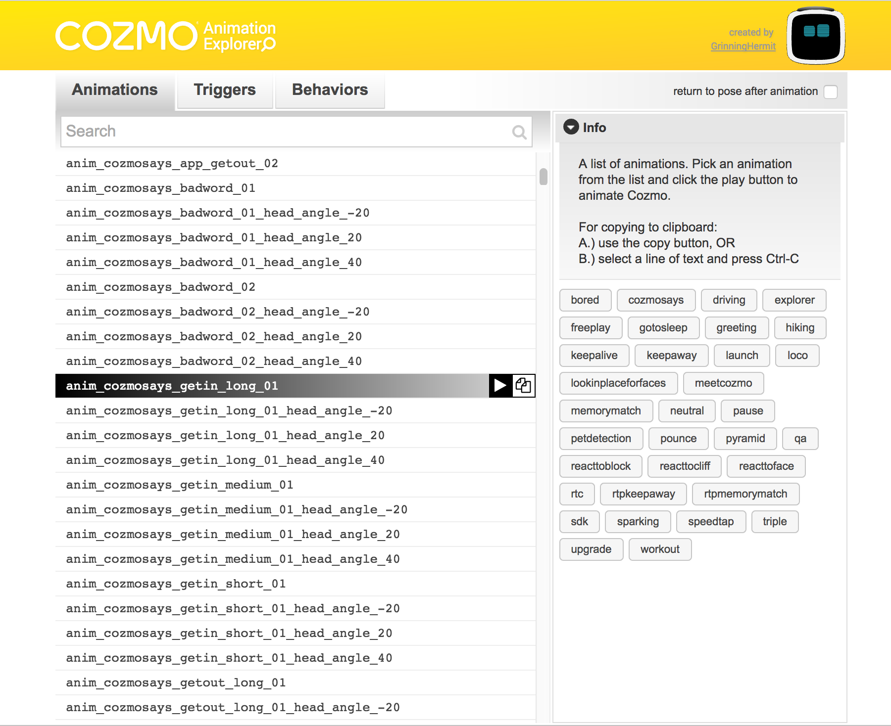

# Cozmo Animation Explorer v2.0
Interface to test all animations of the robot Cozmo from Anki
---
While finding out how the SDK of Cozmo works and how to build stuff with it, it appeared there was no listing provided for all the built-in animations the robot can do. This project attempts to remedy that.  

What does it do exactly?
-
Running the script 'animation-explorer.py' in python will open a web page listing all the animations Cozmo has. A user can click the play button of a listed animation and Cozmo will execute it. It is also possible to search for a particular animation and buttons are provided to group animations based on their naming convention. Triggers and Behaviors can also be played. They have separate lists that can be accessed by choosing their respective menu tabs.

Changes compared to v1.0
-
- Triggers can now be played. They are group names for a set of similar animations. When played, one of the animations from the set is picked randomly.
- Behaviors can now be played. They are ongoing sets of instructions that can be interrupted. I.e.: Playing 'KnockOverCubes' will cause Cozmo to crash a stack of cubes he sees. If no stacked cubes are visible, he will do nothing.
- An option 'return to pose' can be checked. Depending on the animation Cozmo executes, he can move around. Not every animation ends where he started. This checkbox makes sure he returns to the pose he had before the animation starts.
- Playing an animation is now achieved by clicking a button that appears on the line that has the mouse cursor hovering over it.
- Copying the animation can now be done by clicking a button that appears on the line that has the mouse cursor hovering over it OR by selecting the text of the animation name and using the keyboard shortcut Ctrl-C (Windows/Linux) or Command-C (Mac).

What do you need to use it?
-
1. Cozmo himself (http://anki.com/cozmo)
2. A PC and a mobile device
3. A little knowledge about Python
4. Knowledge of the Cozmo SDK (http://cozmosdk.anki.com/docs)
5. The files in this repository

If you know how to run an example file from the Cozmo SDK, you should be able to run this script. 

System requirements
-
- PC with Windows OS, mac OSX or Linux
- Python 3.5.1 or later
- WiFi connection
- An iOS or Android mobile device with the Cozmo app installed, connected to the PC via USB cable

Installation notes
-
- Running 'animation-explorer.py' will attempt to open a browser window at 127.0.0.1:5000. This is similar to  'remote_control_cozmo.py' from the Cozmo SDK examples.
- Install the entire project, not just the .py file, or it won't work.

