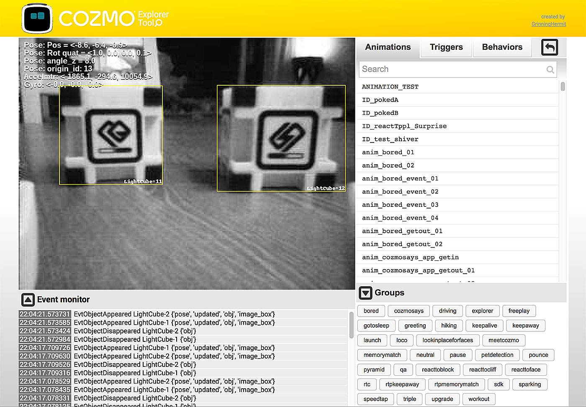

# Cozmo Explorer Tool v0.5
Interface exposing functionality of the robot Cozmo from Anki
---
This tool gives control over Cozmo. You can look through his camera while using keyboard buttons to control him. The event monitor helps in checking when he detects something, like seeing a cube or being picked up. It also includes all functions from the Animation Explorer, listing and playing all built-in animations. Making a movie, scaring your cat or writing code should be easier using the Cozmo Explorer Tool. A lot of the code is derived from remote-control-cozmo.py from the SDK examples and [cozmo-tools](https://github.com/touretzkyds/cozmo-tools)' event monitor.

What does it do exactly?
-
Running the script 'explorer_tool.py' in python will open a web page. It is divided in 3 sections:

1. ROBOT CAMERA AND CONTROL: A constant camera feed is visible. While mousing over this area, controls for Cozmo are also visible, indicating how to control Cozmo with the keyboard. It's also possible to make the feed full screen and turn on the IR light or turn on free play mode which makes Cozmo roam around freely as if he's in 'app' mode instead of SDK mode.

2. EVENT MONITOR: This area shows what events are triggered on Cozmo and when they happen. Tap a cube to see it being logged, or see what happens when he detects a face, dog, cat or cube. Very useful for studying what behaviors do.

3. ANIMATIONS: Everything from the earlier tool Cozmo Animation Explorer is present. A user can click the play button of a listed animation and Cozmo will execute it. It is also possible to search for a particular animation and buttons are provided to group animations based on their naming convention. Triggers and Behaviors can also be played. They have separate lists that can be accessed by choosing their respective menu tabs.

What do you need to use it?
-
1. Cozmo himself (http://anki.com/cozmo)
2. A PC and a mobile device
3. A little knowledge about Python
4. Knowledge of the Cozmo SDK (http://cozmosdk.anki.com/docs)
5. The files in this repository
6. The python module Pillow. (pip3 install --user Pillow, usually already installed when working with the Cozmo SDK)
7. The python module Flask. (pip3 install --user flask)
8. The python module Flask Socket-IO. (pip3 install --user flask-socketio)

If you know how to run an example file from the Cozmo SDK, you should be able to run this script. 

System requirements
-
- PC with Windows OS, mac OSX or Linux
- Python 3.5.1 or later
- WiFi connection
- An iOS or Android mobile device with the Cozmo app installed, connected to the PC via USB cable

Installation notes
-
- Running 'animation-explorer.py' will attempt to open a browser window at 0.0.0.1:5000. This is similar to  'remote_control_cozmo.py' from the Cozmo SDK examples.
- Install the entire project, not just the .py file, or it won't work.

